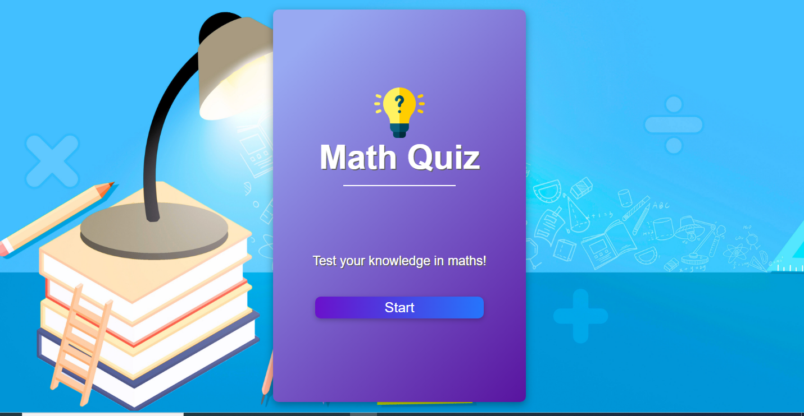
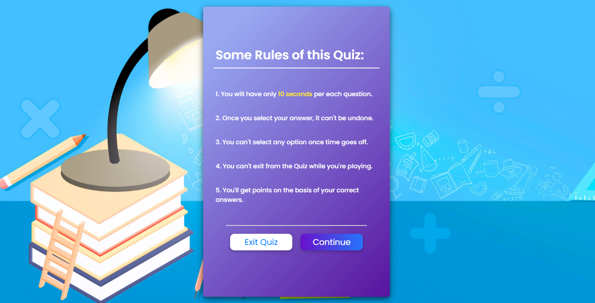
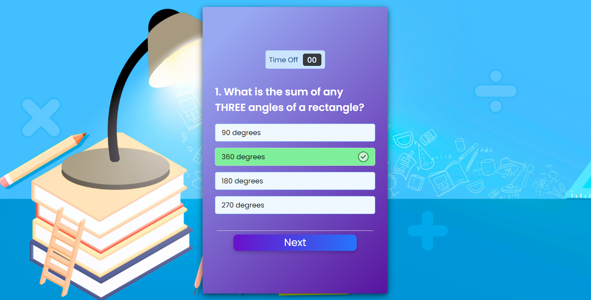
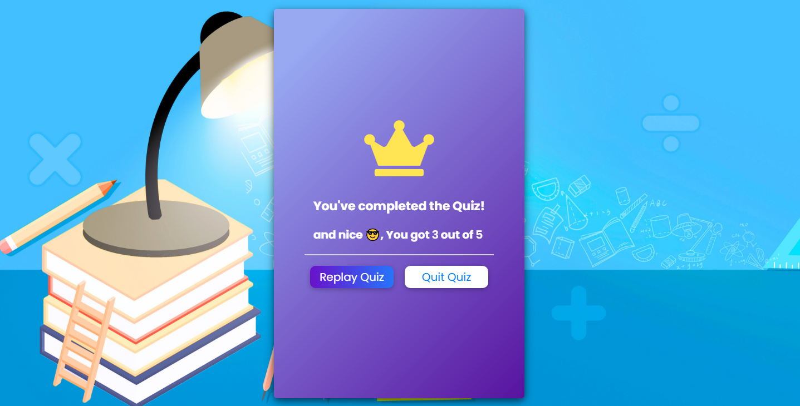

# Webstack portfolio project: Math Quiz App

## Description and overview
**his Math Quiz web application is designed specifically for 6th-grade students to practice and improve their math skills. The application includes various types of math questions, with a user-friendly interface that makes learning fun and interactive.**

## Motivation

  **As a math teacher, This project was developed to create a fun and educational tool that helps 6th-grade students practice their math skills outside the classroom. The motivation behind this project was to provide an accessible learning platform that reinforces mathematical concepts in an interactive manner, catering specifically to young learners. The aim was to combine education with engagement to foster a love for mathematics among students.**

## problem solved

**The Math Quiz WebApp addresses the need for accessible, interactive math practice for 6th-grade students. It solves several problems:**

+ **Lack of Engagement:** Traditional math exercises can be boring for students. This app makes learning fun through interactive quizzes.
  
+ **Practice and Mastery:** Provides students with a tool to practice math problems repeatedly, helping them master core concepts.
  
+ **Immediate Feedback:** Offers instant feedback on answers, helping students learn from their mistakes in real-time.
  
+ **Accessibility:** Being a web-based application, it is easily accessible from **any device** with a web browser.

## I have learned

**Through the development of this project, several key lessons were learned:**

+ **Frontend Development Skills:** Enhanced proficiency in HTML, CSS, and JavaScript to create a dynamic and responsive web application.

+ **User Experience Design:** Gained insights into designing an application that is both engaging and user-friendly for young students.
  
+ **Problem-Solving:** Developed problem-solving skills to address various challenges, such as random question generation and scoring logic.
 
+ **Educational Tools Development:** Learned how to create educational content that is both instructive and entertaining.

## Features

**This project stands out due to its unique combination of features specifically designed for young learners:**

+ **Tailored Content:** The quizzes are tailored for 6th-grade math curriculum, making it highly relevant for the target audience.

+ **Interactive Quizzes:** Multiple-choice questions covering basic arithmetic and geometric.

+ **Scoring System:** Tracks correct answers and provides immediate feedback to help students learn from their mistakes.

+   **Scalability:** The app can easily be expanded to include other subjects or grade levels in the future.

+ **User-Friendly Interface:** A simple, intuitive interface designed for young students, ensuring ease of use and navigation.

## **Technologies Used**

+ **HTML:** For structuring the content.
  
+ **CSS:** For styling the application and making it visually appealing.
  
+ **JavaScript:** For implementing interactive features and quiz logic.

+ **Vs Code and NotePad++** : For writing the code

+ **Github descktop** : for clone and push the updates the project files

## Design

### Starting page: 

### The rules of Quiz: 

### The quiz box : 

### the results box : 

## Installation Instructions
**To run the Math Quiz web application locally, follow these steps:**

1. Download the repository to your local host from the following link: https://github.com/Medidali/Webstack---Portfolio-Project
2. Navigate to the Project Diroctory 
3. Open index.html in a Web Browser

## Contact
If you have any questions or need further information, feel free to contact us at: m.mohamedidali@gmail.com.
